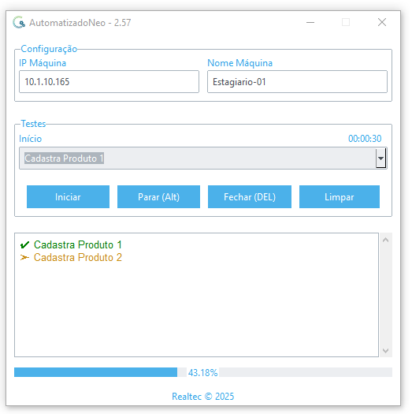

Projeto construído para auxiliar na validação do sistema Neo da Realtec Solução em Gestão.

    

## 🚀 Tecnologias Utilizadas
O projeto foi construído utilizando as seguintes tecnologias:
- Python
- Pyautogui
- Pywinauto

## 📩 Contato
📩 Contato: eric_lamounier@outlook.com
